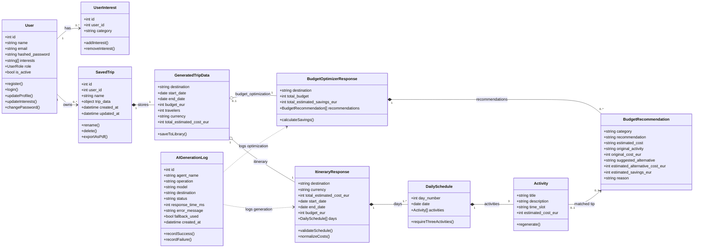
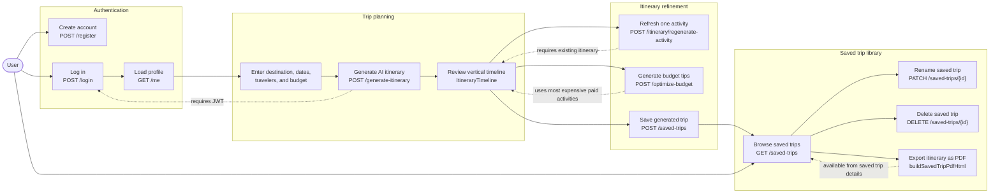
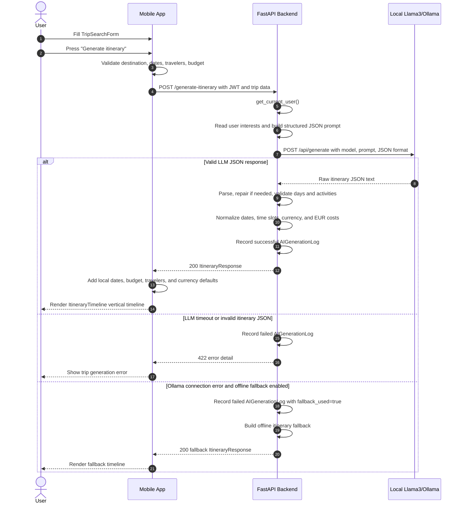
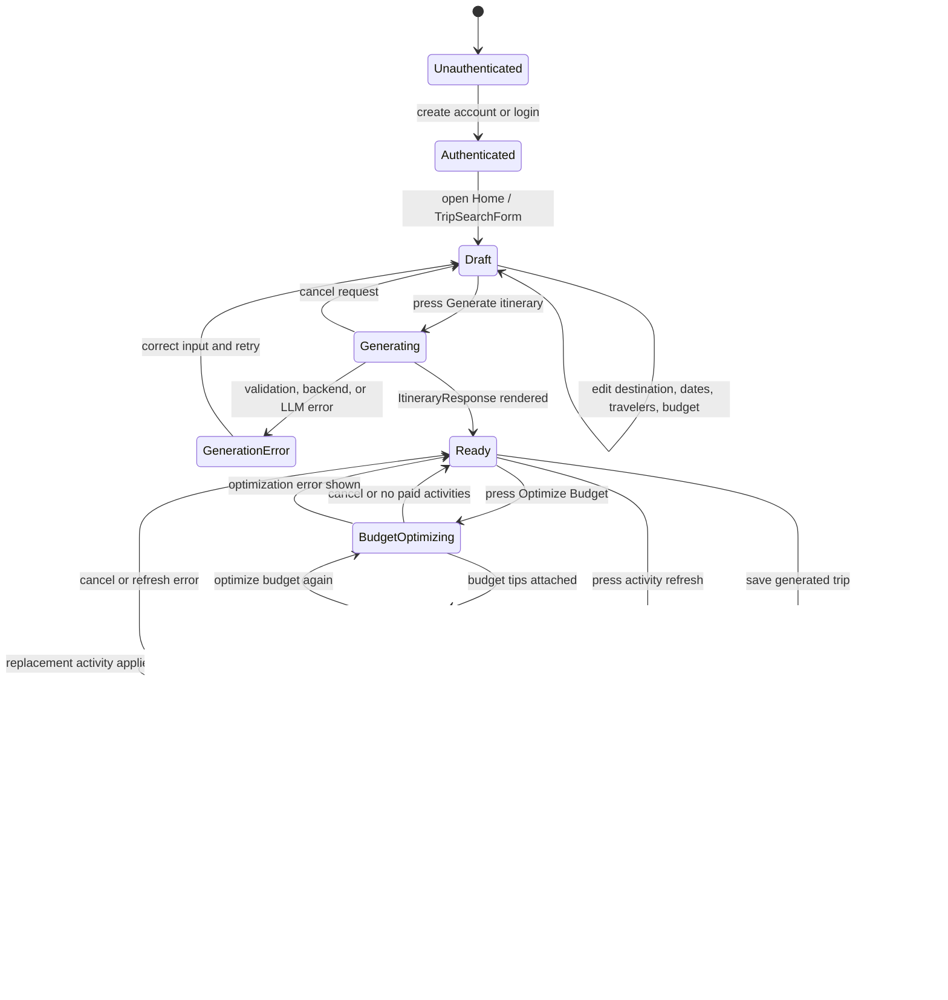
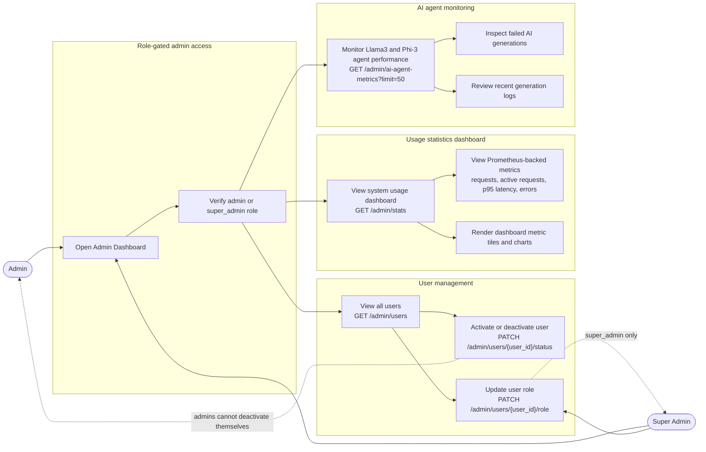
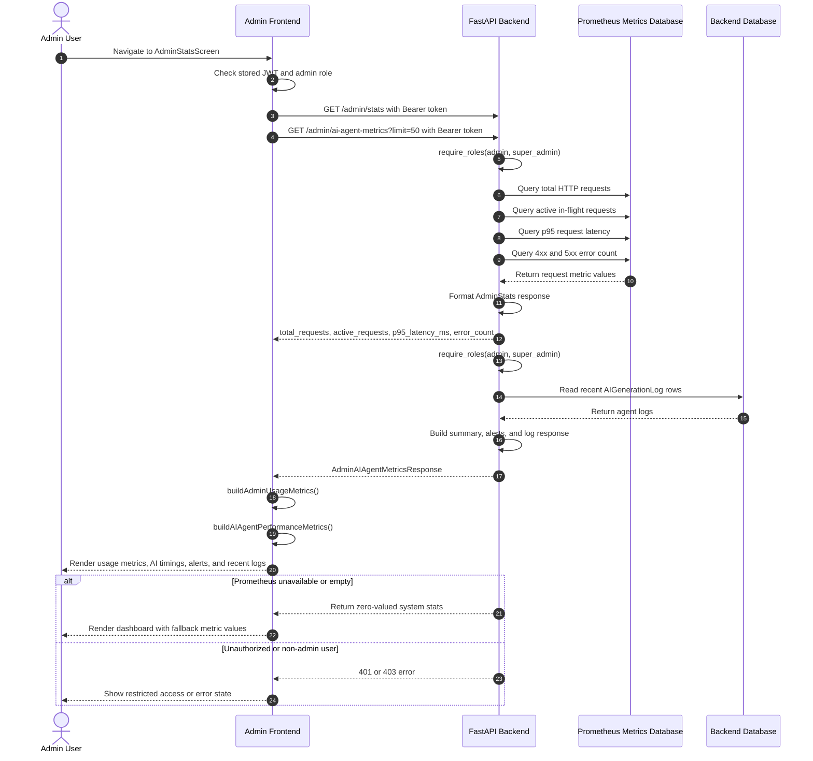
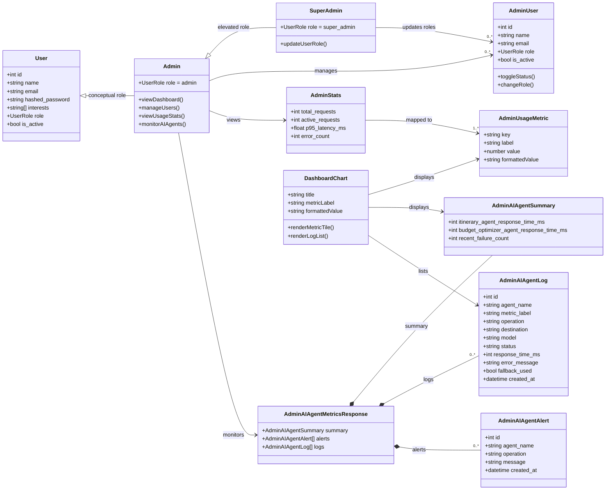

# ✈️ AI Travel Planner

> *Your personal AI travel buddy — no agency fees, no boring itineraries.*

Ever stared at a blank browser tab trying to plan a trip? This app helps you go from “maybe Paris?” to a full day-by-day itinerary, budget tips, saved trips, and PDF exports. It uses a React Native / Expo mobile app, a FastAPI backend, and local Ollama models, so you can build and test the whole thing without paid AI API keys. 🌍

---

## Table of Contents

- [What You Can Do](#what-you-can-do)
- [Tech Stack](#tech-stack)
- [Quick Start](#quick-start)
- [Running on a Real Phone](#running-on-a-real-phone)
- [Using the App](#using-the-app)
- [Demo Accounts](#demo-accounts)
- [Services & Ports](#services--ports)
- [Configuration](#configuration)
- [Admin & Monitoring](#admin--monitoring)
- [Running Tests](#running-tests)
- [Project Layout](#project-layout)
- [Architecture & UML](#architecture--uml)

---

## What You Can Do

| Feature | Description |
|---------|-------------|
| 🗺️ **AI Itinerary Generator** | Enter a destination, dates, travelers, and budget, then get a structured daily plan. |
| 💸 **Budget Optimizer** | Ask the AI for cheaper alternatives to the most expensive paid activities. |
| 🔁 **Activity Refresh** | Replace one activity without throwing away the whole itinerary. |
| 📌 **Saved Trip Library** | Save generated trips, rename them, delete them, and review them later. |
| 📄 **PDF Export** | Download or share saved itineraries as PDFs from the library screen. |
| 🎯 **Travel Interests** | Save preferences like food, nature, nightlife, culture, family-friendly, and more. |
| 🔐 **Auth & Profiles** | Register, log in, update your profile, and change your password. |
| 🛡️ **Admin Dashboard** | Manage users, roles, account status, AI logs, and backend usage metrics. |

---

## Tech Stack

| Layer | Tools |
|-------|-------|
| 📱 Mobile app | React Native, Expo, TypeScript, NativeWind, lucide-react-native |
| ⚙️ Backend API | FastAPI, SQLAlchemy, Pydantic, PyJWT, bcrypt |
| 🤖 Local AI | Ollama with `llama3` and `phi3` pulled by Docker Compose |
| 📊 Monitoring | Prometheus, Grafana, `prometheus-fastapi-instrumentator` |
| 🧪 Tests | Pytest for backend, Jest + jest-expo for frontend |
| 🐳 Dev runtime | Docker Compose for backend, Ollama, Prometheus, and Grafana |

---

## Quick Start

### 1. Install the essentials

- **Docker Desktop** 🐳
- **Node.js LTS** and npm
- **Expo Go** on your phone, if you want to test on a real device

> Python is only needed if you decide to run the backend outside Docker. The normal setup below uses Docker for the backend.

### 2. Install the frontend packages

```bash
cd frontend
npm install
cd ..
```

### 3. Create the backend environment file

Mac / Linux:

```bash
cp backend/.env.example backend/.env
```

Windows PowerShell:

```powershell
Copy-Item backend/.env.example backend/.env
```

For local development, the defaults are ready to go. Before sharing or deploying anything, change `JWT_SECRET_KEY` in `backend/.env`. 🔑

### 4. Start the backend stack

```bash
docker compose up
```

This starts FastAPI, Ollama, Prometheus, and Grafana. On the first run, Docker also pulls the `llama3` and `phi3` Ollama models, so the first startup can take a few minutes. ☕

### 5. Start the Expo app

Open a second terminal:

```bash
cd frontend
npm start
```

Then scan the QR code with **Expo Go**, or use the Expo terminal options to open Android, iOS, or web.

---

## Running on a Real Phone

Your phone and computer must be on the same network. The app auto-detects the Expo dev host and uses port `8000`, so you usually do **not** need to edit `frontend/src/services/api.ts`.

If auto-detection fails, create `frontend/.env.local`:

```bash
EXPO_PUBLIC_API_URL=http://YOUR_WIFI_IP:8000
```

Then restart Expo. On Windows, find your IP with `ipconfig`; on macOS, `ipconfig getifaddr en0` is usually the quickest option. 📱

---

## Using the App

1. **Log in or register** 🔐  
   The backend seeds demo users on startup, but you can also create your own account from the app.

2. **Choose your interests** 🎯  
   Update your profile with travel preferences so generated plans feel more like you.

3. **Generate a trip** ✨  
   On Home, enter a destination, start date, end date, traveler count, and budget. The app sends those details to `POST /generate-itinerary`.

4. **Refine the itinerary** 🔁  
   Refresh individual activities, then use **Optimize Budget** to get cheaper alternatives for high-cost activities.

5. **Save and export** 📌  
   Save the result to your library, reopen it later, rename it, delete it, or export it as a PDF.

6. **Use admin tools** 🛡️  
   Admin users can manage accounts and open the AI Agent Performance screen for model timing, failed generations, recent logs, and backend health.

---

## Demo Accounts

These are created automatically when the backend starts. They are meant for development and demos only. 🙂

| Role | Name | Email | Password |
|------|------|-------|----------|
| `super_admin` | Elena Super Admin | `elena.super.admin@example.com` | `ElenaSuperAdmin1` |
| `admin` | Andrei Admin | `andrei.admin@example.com` | `AndreiAdmin1` |
| `admin` | Maria Admin | `maria.admin@example.com` | `MariaAdmin1` |
| `user` | Emma Ionescu | `emma.ionescu@example.com` | `EmmaUser1` |
| `user` | Alex Popescu | `alex.popescu@example.com` | `AlexUser1` |
| `user` | Sofia Marin | `sofia.marin@example.com` | `SofiaUser1` |
| `user` | David Georgescu | `david.georgescu@example.com` | `DavidUser1` |

---

## Services & Ports

| Service | URL | What's there |
|---------|-----|--------------|
| FastAPI | `http://localhost:8000` | Backend API, health check at `/health`, docs at `/docs` |
| Ollama | `http://localhost:11434` | Local AI inference for `llama3` and `phi3` |
| Prometheus | `http://localhost:9090` | Raw backend metrics |
| Grafana | `http://localhost:3000` | Provisioned dashboards, default login `admin` / `admin` |

---

## Configuration

The main backend settings live in `backend/.env`.

| Variable | What it controls | Default for Docker |
|----------|------------------|--------------------|
| `DATABASE_URL` | SQLite database path | `./travel.db` |
| `JWT_SECRET_KEY` | JWT signing secret | Replace this for real use |
| `AI_AGENT_PROVIDER` | AI provider selection | `ollama` |
| `OLLAMA_BASE_URL` | Backend-to-Ollama URL | `http://ollama:11434` |
| `OLLAMA_MODEL` | General model | `llama3` |
| `OLLAMA_ITINERARY_MODEL` | Itinerary model | `phi3` |
| `OLLAMA_FALLBACK_MODEL` | Fallback model | `phi3` |
| `PROMETHEUS_URL` | Backend-to-Prometheus URL | `http://prometheus:9090` |
| `ENABLE_METRICS_ENDPOINT` | Exposes `/metrics` for Prometheus | `true` |
| `GF_SECURITY_ADMIN_USER` | Grafana username | `admin` |
| `GF_SECURITY_ADMIN_PASSWORD` | Grafana password | `admin` |

If you run the backend directly on your computer instead of Docker, change `OLLAMA_BASE_URL` to `http://localhost:11434`.

---

## Admin & Monitoring

Admins and super admins can open the admin area from the Home screen. The backend protects these routes with role checks:

- `GET /admin/users`
- `PATCH /admin/users/{user_id}/status`
- `PATCH /admin/users/{user_id}/role` — super admin only
- `GET /admin/stats`
- `GET /admin/ai-agent-metrics?limit=50`

Prometheus scrapes the backend `/metrics` endpoint, and Grafana loads the dashboard provisioning from `monitoring/grafana/provisioning`. The app's **AI Agent Performance** screen polls the admin stats and AI metrics endpoints every 10 seconds. 📈

---

## Running Tests

Backend tests:

```bash
docker compose exec backend pytest
```

Frontend tests:

```bash
cd frontend
npm test
```

You can also run the Expo TypeScript check from the frontend folder:

```bash
npx tsc --noEmit
```

---

## Project Layout

```text
Travel-planner/
├── backend/          FastAPI app, AI services, database models, tests
├── frontend/         Expo / React Native app, screens, components, tests
├── monitoring/       Prometheus and Grafana provisioning
├── docker-compose.yml
├── package.json
└── README.md
```

---

## Architecture & UML

The diagrams below document the main app flows, data model, and admin monitoring features.

### 1. Class Diagram



### 2. Use Case Diagram



### 3. Sequence Diagram: Generate New Itinerary



### 4. State Machine Diagram: Travel Itinerary Lifecycle



### 5. Admin Use Case Diagram



### 6. Sequence Diagram: Load Admin Usage Statistics Dashboard



### 7. Admin Class Diagram



---

*Built with ❤️ as a university project. Have fun planning the next escape. 🌤️*
