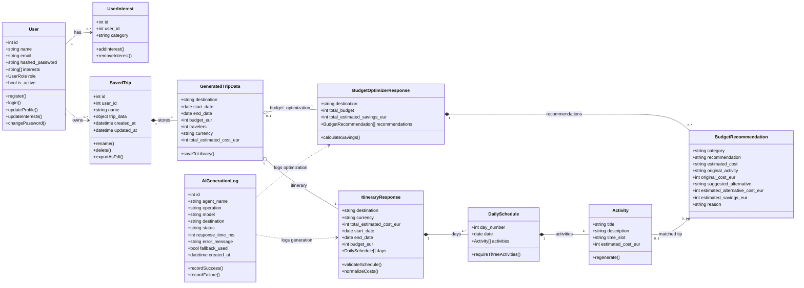
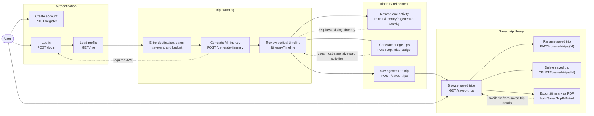
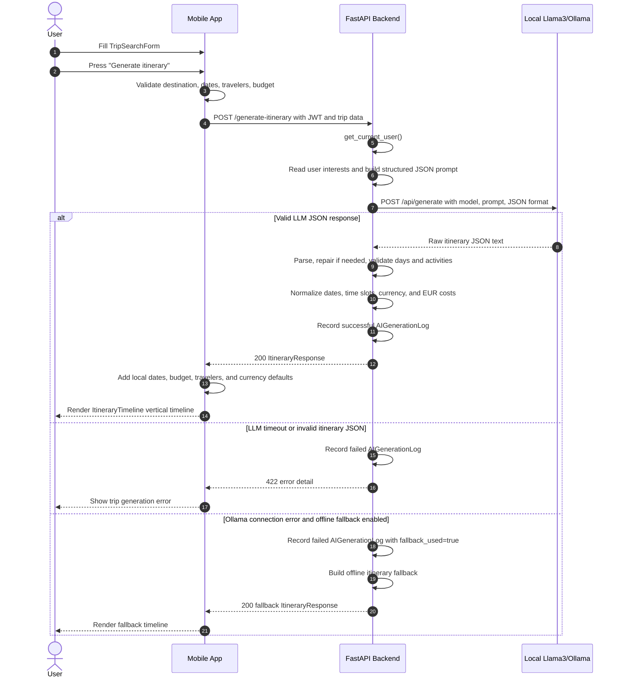
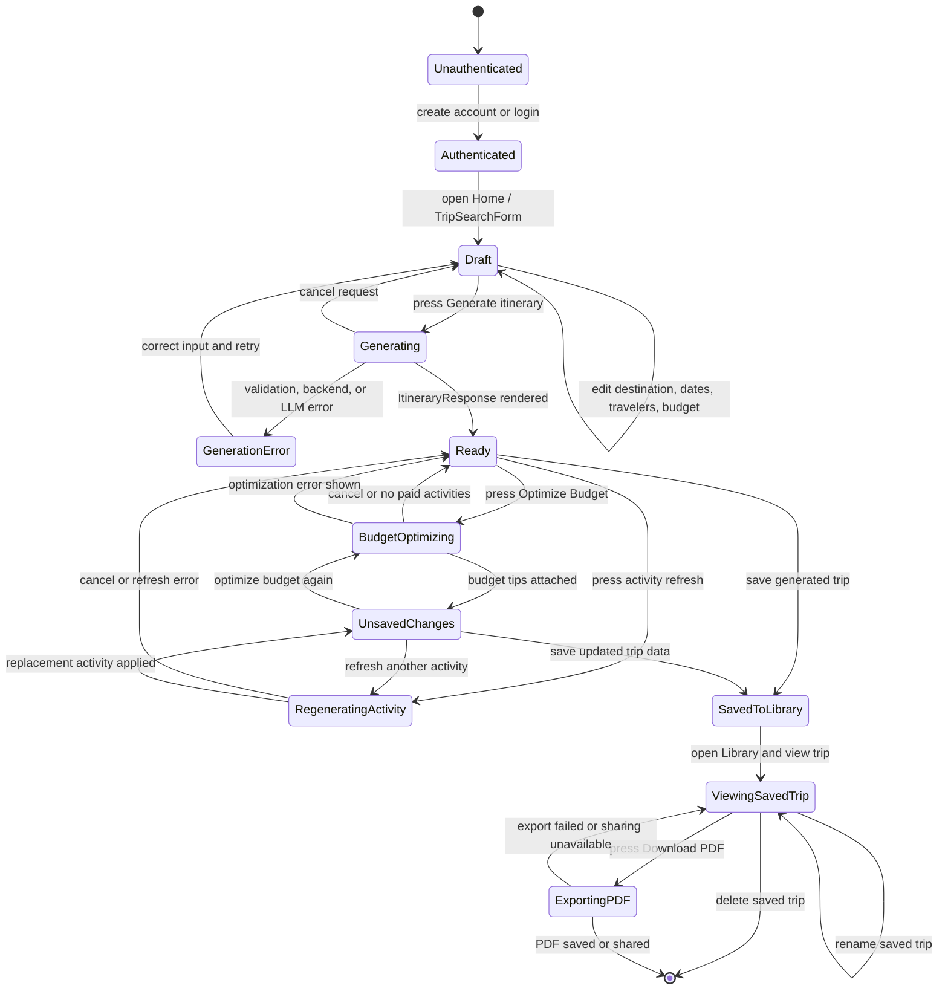
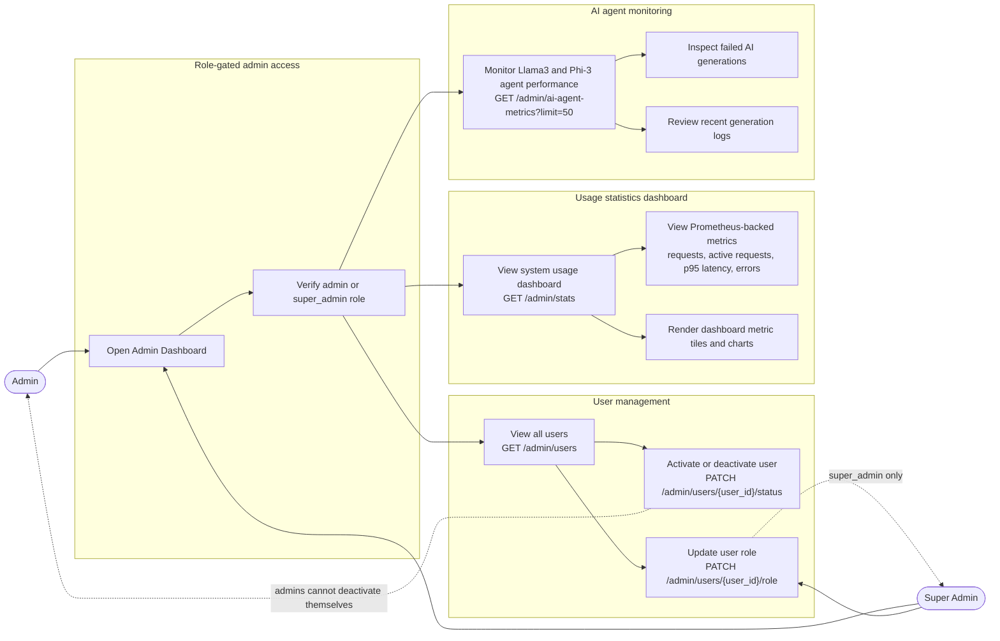
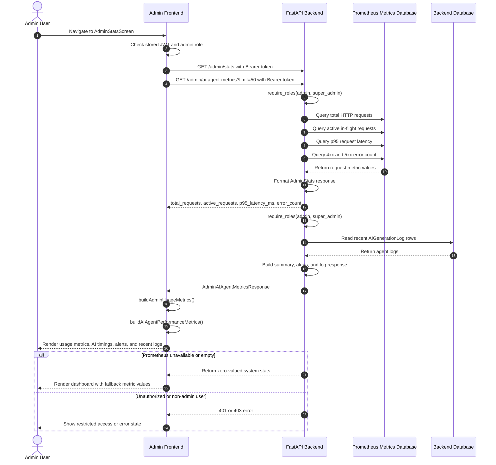
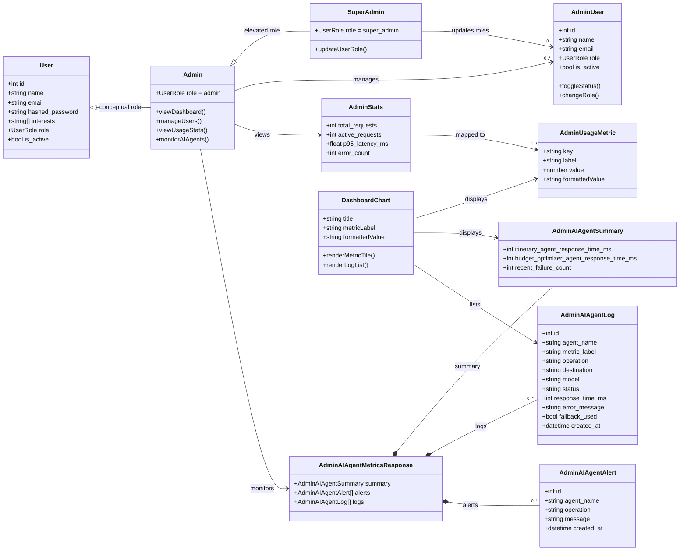

# Architecture & UML

The diagrams below document the main app flows, data model, and admin monitoring features.

## 1. Class Diagram

## 2. Use Case Diagram

## 3. Sequence Diagram: Generate New Itinerary

## 4. State Machine Diagram: Travel Itinerary Lifecycle

## 5. Admin Use Case Diagram

## 6. Sequence Diagram: Load Admin Usage Statistics Dashboard

## 7. Admin Class Diagram

